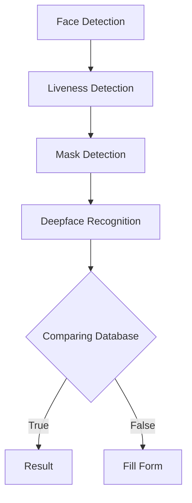

# Face Recognition with Liveness Detection, Mask Detection, and PostgreSQL Integration

This project utilizes facial recognition techniques, including liveness detection, mask detection, and face recognition, combined with a PostgreSQL database. The implementation involves the use of the MiniVGG model for liveness and mask detection, a pre-trained face detector (res10_300x300_ssd_iter_140000.caffemodel), and DeepFace from Facebook for face recognition.

## Introduction

This repository contains a comprehensive Face Recognition System with additional features such as liveness detection, mask detection, and face detection. The system utilizes the MiniVGG architecture for liveness and mask detection, the ResNet-based face detector (res10_300x300_ssd_iter_140000.caffemodel), and DeepFace Facebook for face recognition. The system is integrated with a PostgreSQL database for efficient data storage and retrieval.

Liveness Detection Model : [livenessDetection](https://github.com/AJustiago/Liveness-Detection)
Mask Detection Model     : [maskDetection](https://github.com/AJustiago/Mask-Detection)

## File Structure
Here is the file structure 
```bash
    .
    |---Database
    |   |-database
    |   |-pickle-file--for-deepfake-Recognition
    |
    |---Face-Detector--for-face-Detection
    |  
    |---liveness
    |   |-liveness-pickle
    |   |-liveness-model
    |
    |---mask
    |   |-mask-detection-pickle
    |   |-mask-detection-model
    |
    |---upload--temp-files-for-images-capture
    |
    |-env
    |-main.py
    |-nginx.conf
```
## Flow Repository



## Installation

To set up the required environment, follow these steps:

1. **Clone the Repository:**
   ```bash
   git clone https://github.com/AJustiago/Face-Recognition.git
   cd Face-Recognition

2. **Install Dependencies:**
    ```bash
    pip install -r requirements.txt
    ```
    This command will install all the necessary Python packages specified in the [requirements](https://github.com/AJustiago/Face-Recognition/blob/main/requirements.txt) file.


## Acknowledge

1. Deepface Facebook [https://github.com/serengil/deepface](https://github.com/serengil/deepface)
2. The MiniVGG architecture is inspired by the original VGGNet [1].

[1] Simonyan, K., & Zisserman, A. (2014). Very Deep Convolutional Networks for Large-Scale Image Recognition. arXiv preprint arXiv:1409.1556.
